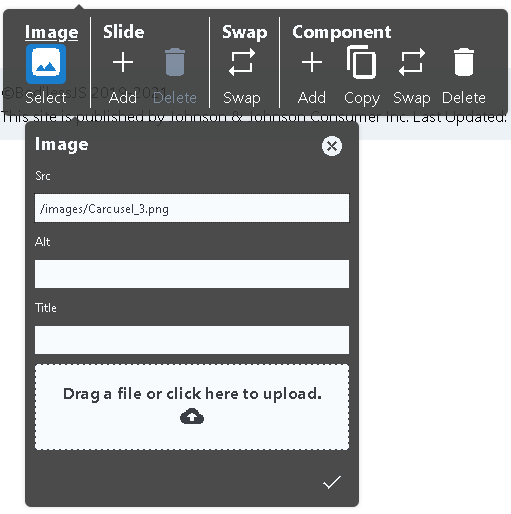
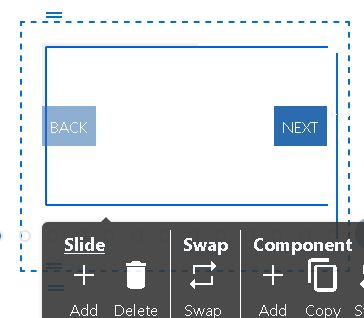

# Carousel Component

The Carousel is a component that allows you to create a slideshow. The Carousel
can be used to display a number of things that may be of interest to site
viewers. These may include customers, features, or individuals.

A basic Carousel contains images. You can add text via a Rich Text box next to
a Carousel. Each image object contains only the image, alt text, and the image title.

## Content Editor Details

BodilessJS offers the option to add slides to a Carousel. Each slide has one
image.

### Place a Carousel

First, click the Insert Component button and select "Carousel" on the left side of the
window. To place a Carousel on your Website, click the Carousel image in the Insert
Component window. 

   This adds a plain Carousel component to your Website.

### Add Images to Carousel

Add an image to the slide by clicking on the placeholder image. Then, click
on the "Image" button on the tool bar. This calls up the Image menu. Under "src,"
enter the path to the image (usually `/images/imagename.png`). You can also add alt
text or a title for the image. You can also drag a file to the image menu to
upload it to your site.

### Add Slides to Carousel

To add another slide, click the "Add" button under "Slide" in the toolbar. Repeat
thie step until you are finished adding slides.

### Resize Carousel

Resize the Carousel by clicking near the blue line on the ride edge of it and
dragging to expand or contract.

### Move Carousel

Move the Carousel by clicking the two lines at the top left of it and
dragging to the desired place on your page.

